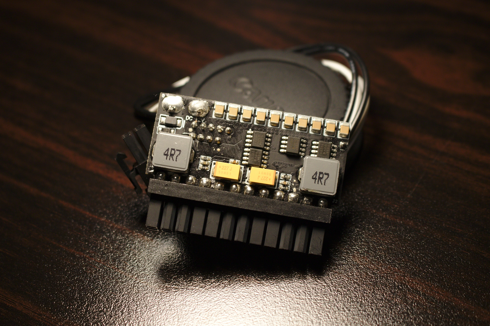

We're going to be getting pretty niche, and small form factor builds are already a niche inside the niche of pc building. Today we'll be examining the unconvential way of delivering power to the components by splitting up the psu into several pieces. One part for converting AC from the wall into DC and one or more parts to distribute said DC to the components. Nothing new here -- this power delivery method is how laptops work and even the desktop form has been around awhile in the form sometimes colloquially referred to as a pico psu.

But we're not here to look at laptops or the picoPSU brand. We're here to for J-HACK's duo: ONE2 Plugin and ONE2 Distro 400:

## The build

I purchased ONE2 plugin and distro back in August for use inside the Skyreach 4 Mini, which [J-HACK makes a kit especially for](https://j-hackcompany.com/?product=one2-distro-250w-skyreach-4-mini-edition). Six days after ordering, the kit was shipped and soon at my doorstep (this was intra-US shipping). I find this short turn around impressive and worth mentioning in a world of boutique sff vendors. Without further ado, here is the kit in action; powering an [undervolted GTX 1070](/how-to-undervolt-gpu/) and an [undervolted Ryzen 2700](/how-to-undervolt-ryzen-cpu/) (see the guides for more info on how to undervolt).

There was a small hiccup in shipping. While assembling in the S4M there appeared to be a piece missing, which after assuring myself it wasn't anything to do with my lackluster problem solving skills, I sent a message to J-HACK through [smallformfactor.net](https://smallformfactor.net). Within 3 minutes I received a reply identifying the missing piece as the 6 to 8 pin adapter between the included brick (more on that later) and distro 400. The missing piece was shipped free of charge and I received it a few days later. Definitely top notch support.

The only other area that gave me problems is that there are multiple CPU EPS connectors included in the kit. One is for connecting the plugin unit to the CPU and the other one is for connecting the distro unit to the CPU. I made the mistake of powering the CPU from the plugin unit. While the PC would operate normally while in use, waking from sleep would cause a restart with CMOS cleared and BIOS reset. Not ideal. Eventually I figured it out (pictured below), but instructions clarifying this online or in the package may have made this a non-issue.

, not the plugin unit")

To be fair though, it is shown in [J-HACK's ONE2 distro 400 youtube video](https://www.youtube.com/watch?v=IyIMXIN_xtY) that the cpu is connected to the distro.

After getting the missing piece and doing some light problem solving this system has been rock solid and has been my daily driver ever since.

## The brick in the room

While the distro is compatible with any 12v DC source, the AC-DC converter that ships with the S4M kit is the [Meanwell GST280A12-C6P brick](https://www.mouser.com/ProductDetail/MEAN-WELL/GST280A12-C6P?qs=XfZQyRplo5S6bkFXOs4q7w%3D%3D) and it's a big one -- about a liter in size and same width and thickness as the case.

I used to be a hardline brickless adherent. I wouldn't even think twice about cases that required a external brick, but over the last couple months this brick has grown on me for one big reason: silence. I migrated from a flexATX PSU with a modded noctua fan, which was audible even at idle. So even though some may find this a downgrade in terms of volume, I have the brick mounted underneath my desk so the setup looks as clean as a brickless build and it's inaudible.

Some quick facts about the GST280A12-C6P

- The "280" part of the name may be a bit misleading as the max rated power is 252W
- Typical conversion efficiency measured at 89.5%. Slightly lackluster compared to its internal brethern at 93% ([UHP-200-12](https://www.mouser.com/ProductDetail/MEAN-WELL/UHP-200-12?qs=YCa%2FAAYMW02wbY6zs%252B73Lg%3D%3D) and [RPS-200-12](https://www.mouser.com/ProductDetail/MEAN-WELL/RPS-200-12-C?qs=jRFAGhNBpj9vanBsj8iTeA%3D%3D)). Not great, but not terrible.
- Max ripple is within the ATX spec (something that UHP-200-12 exceeds)

Overall the brick is large but quiet and in spec (safe).

## The extras

Not everything that was packaged is necessary for the build. Here are the components leftover:

- SATA power cables. I'm a staunchly M.2 only. But these cables would tie into the ONE2 plugin unit.
- DC jack for use with other bricks. Though I'd believe one would need a 4 to 8 pin adapter to connect it the distro unit. One *should* also be able to connect the plugin unit directly to this DC jack for scenarios where the distro 400 is unneeded (APU / iGPU builds).
- ONE2 plugin to CPU 4pin EPS connector. From my experience, should only be used in situations where the distro 400 is unused (APU / iGPU builds)

## The why

So far we've seen what the ONE2 distro kit for the S4M contains and how to build with it, but I haven't divulged into the reasoning why I went bought this originally. If my reasoning could be distilled to a single picture, it'd be the ONE2 plugin unit removing the need of a bulky set of 24 atx cables.

While mostly relegated to workstation and server motherboards, some (like this [X11SDV-8C+-TLN2F](https://www.supermicro.com/en/products/motherboard/X11SDV-8C+-TLN2F)) are able to receive a 12v DC input directly. Builds like with those can be seriously clean as they don't even need a plugin unit or dc distro board. For example, one user on the sff forums [hooked his Meanwell PSU directly to the board](https://smallformfactor.net/forum/threads/project-pure-3l-apu-case-meanwell-support.8588/page-16#post-148224), so the only cables needed are the power button, and 3 wires for power entry to the psu, the a few wires from psu to the board.

I don't necessarily want to launch into a this vs that with other solutions, but I think it is important view my thought process towards SFF power supplies:

- FlexATX: (not compatibile with S4M) I have not encountered a FlexATX psu with a satisfactory noise profile
- Dynamo mini and 360 is the 19v cousin to J-HACK's 12v ONE2 combo. Unfortunately, [KMPKT has stalled production](https://smallformfactor.net/forum/threads/dynamo-mini-availability.11063/#post-153595) so long term viability seemed in doubt.
- [HDPlex 200W DC-ATX](https://hdplex.com/hdplex-200w-dc-atx-power-supply-16v-24v-wide-range-voltage-input.html): An absolute massive plugin unit compared to the ONE2 plugin (I'll have an article forthcoming on this unit). If this had been released earlier in the year I probably would have picked this up in combination with a [slim 19v brick](https://www.dell.com/en-us/work/shop/dell-240-watt-ac-adapter-for-precision-7730/apd/450-ahhe/pc-accessories?ref=p13n_ena_pdp_vv&c=us&cs=04&l=en&s=bsd).
- [HDPlex 400W DC-ATX](https://hdplex.com/hdplex-400w-hi-fi-dc-atx-power-supply-16v-24v-wide-range-voltage-input.html): This DC-ATX needs a 24pin connector, which most people [recommend getting customized](https://nfc-systems.com/shop-all/skywire) for the S4M, but a recent pinout change [prompted headache](https://www.youtube.com/watch?v=n6gQ5ie2Dw0) for a lot of people. I would have only considered this if my gpu, 1070 Aero ITX, fit brickless with the 400w AC-DC. Since it doesn't, using the AC-DC converter, which as a fan, an external brick didn't sit right with me.
- [G-Unique](https://smallformfactor.net/forum/threads/more-g-unique-bto-psus-are-now-available-direct-order.1983/): The most impressive sff psu modder. They make plugin units up to 500W. While most are happy G-Unique customers, others [haven't had as nice as an experience](https://smallformfactor.net/forum/threads/custom_mod-case-sx-sxm.1786/page-41#post-132923). So as lame as a reason as this is, I felt more comfortable with J-HACK, but if you're considering G-Unique, get G-Unique.
- SFX: (not compatible with S4M). A solid form factor that I'd recommend to most people. With J-HACK releasing their [M2427](https://j-hackcompany.com/?product=j-hack-m2427-for-corsair-sf-series) one can now even reduce up to 30 wires down to just 7.

## The future

If a brick is fine for you in theory, but you just wish it was smaller than the Meanwell, then I have good news for you. Recent advancements in [GaN technology](https://en.wikipedia.org/wiki/Gallium_nitride#Transistors_2) has allowed for [2.5x smaller bricks to appear on the horizon](http://www.adaptertech.com.tw/200W-GaN-FET-Power-Supply.html?CID=1). KMPKT has [drummed up some interest](https://smallformfactor.net/forum/threads/price-check-small-200w-ac-dc-brick.10611/) in small 200w bricks. Even TheHack had [some promising news](https://smallformfactor.net/forum/threads/j-hack-mod-shop.6240/page-6#post-162357):

> We will be sampling 300W external kits that are 1/3 the size of today's available brick next year. It'll be quite a premium though!

I'm excited as smaller bricks may remove some of stigma that bricks carry in the community, and allow for more creative case designs.

There is a lot of room left in my build. As a comparison one user made a [brickless 8700k and 1080](https://smallformfactor.net/forum/threads/brickless-s4m-w-gtx1080-and-i8700k-dual-psu-completed.7519/page-7#post-138147) and has returned for a [brickless 3900x and 2080ti](https://smallformfactor.net/forum/threads/s4max-brickless-s4m-w-2080ti-and-r9-3900x-600w-on-water.11277). Surely a 1070 and 2700 is piecemeal in comparison.

I briefly considered using the HDPlex's 400W AC-DC as an external brick, but 

https://hardforum.com/threads/project-one2-12v-distribution-board.1962176/

> WAGO terminal connectors. These allow you to use any wire 18-12AWG, without terminals, so you can get that perfect length. No tools required to use these terminals

https://smallformfactor.net/forum/threads/one2-distro-400-a-12v-power-distribution-board.7687/page-11#post-129322

>  I recommend the Meanwel GST280A12, it can sustain 250W, though it is quite big. It is very affordable, at $90 a part, and you don't have the issue of getting fakes.

## Conclusion

- The ONE2 distro kit for the S4M allows for those with non-existant wiring skills (like yours truly) to 
- J-HACK provides quality customer support
- B
