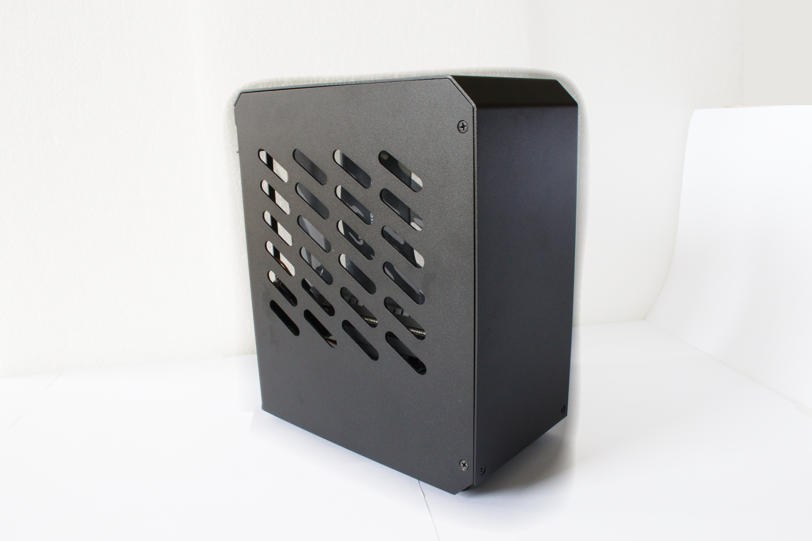
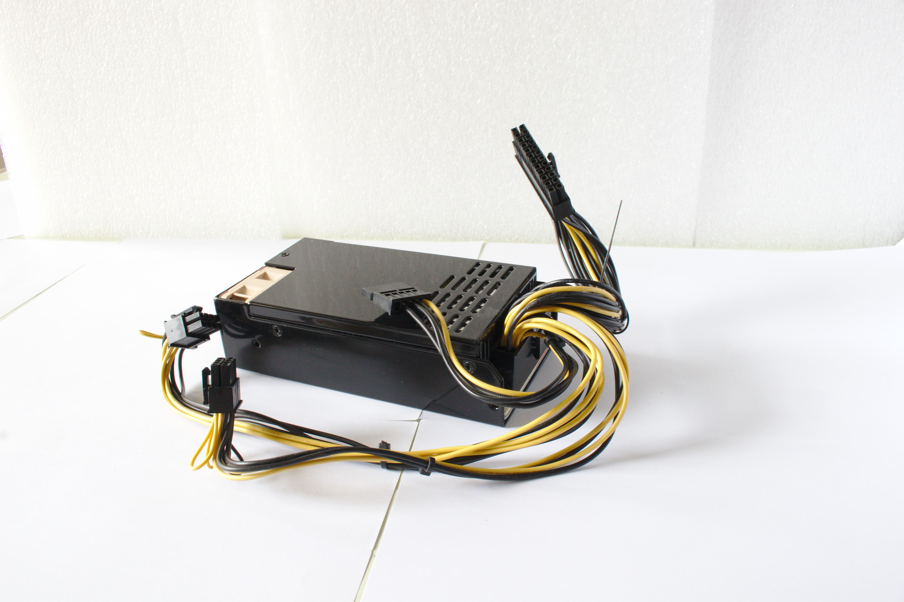
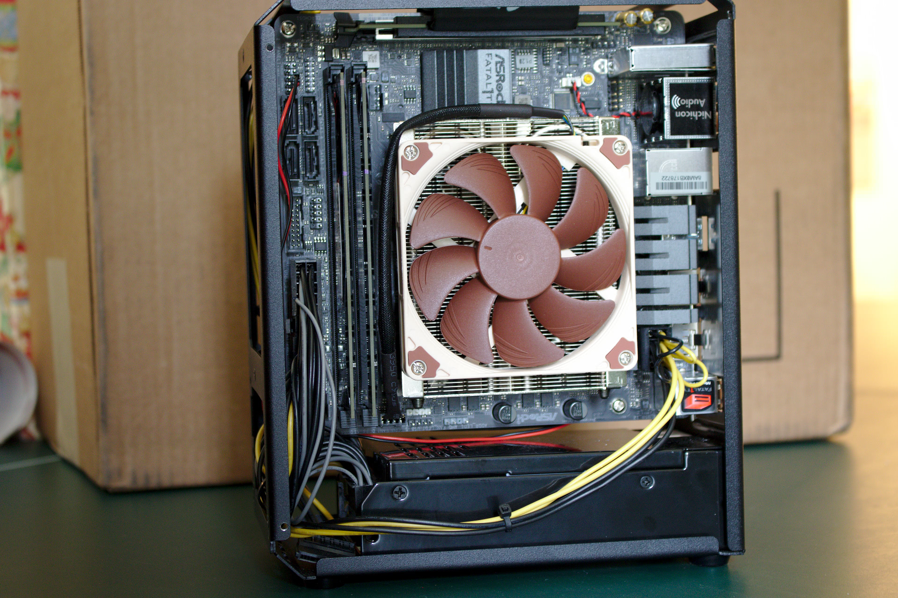
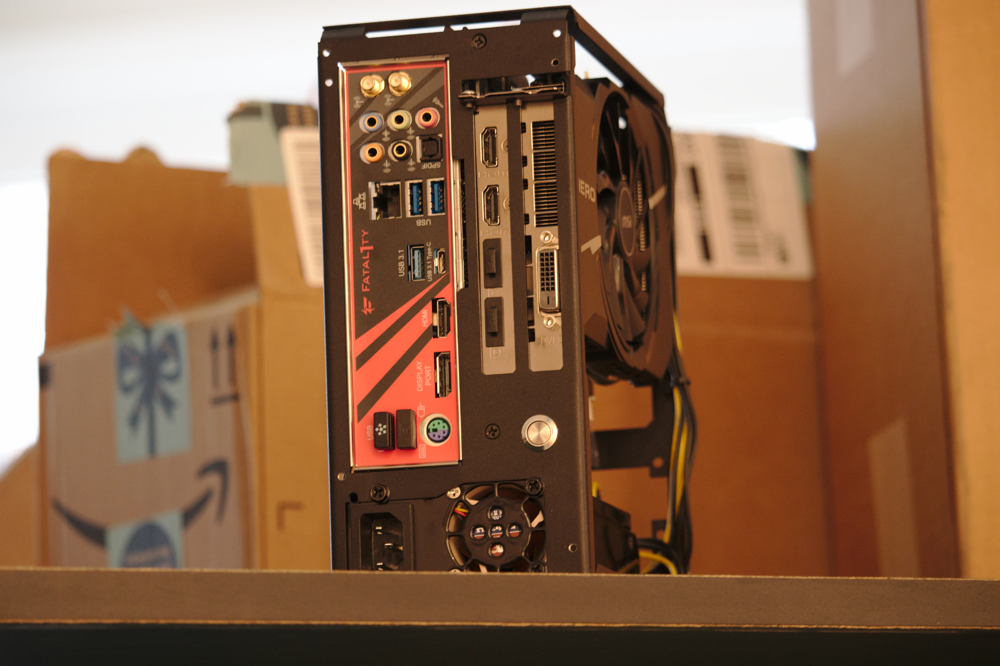
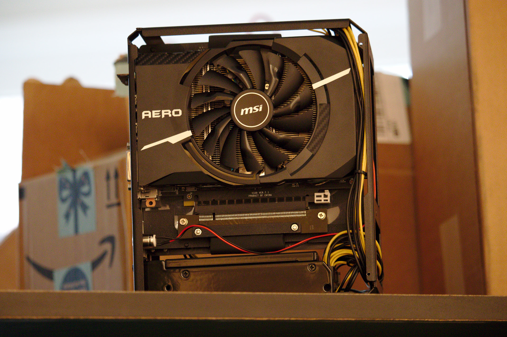
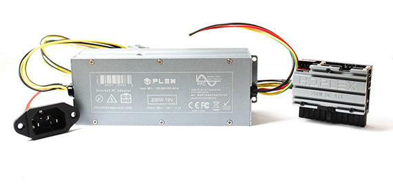
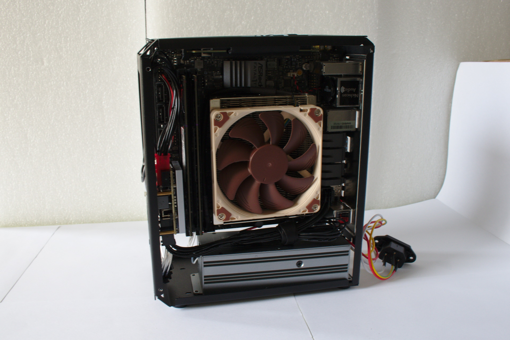
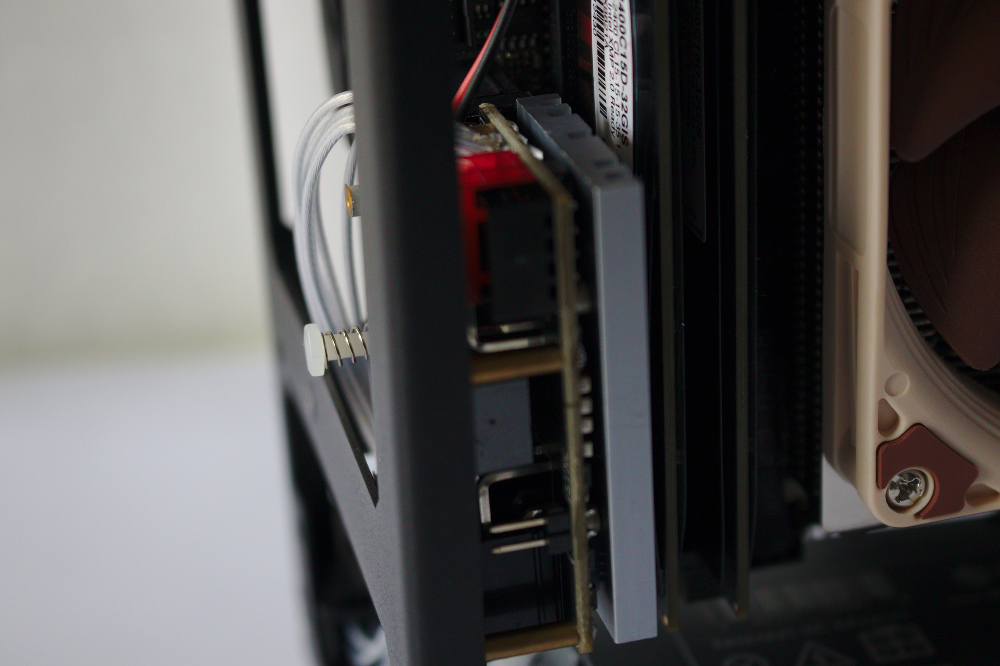
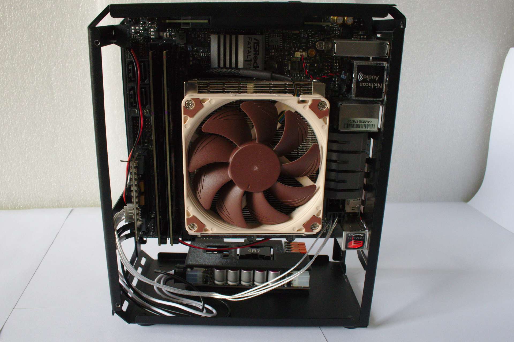

Perhaps one of the longest running, but least discussed purveyor of SFF cases is [CustomMOD](https://www.custmod.com/?lang=en). They've been around for years, slowly churning out new cases, but never seem to be on the forefront -- always a bit fringe. In mid-2018 I decided to purchase [CustomMOD's FLEX 4.5L](https://smallformfactor.net/forum/threads/custom_mod-cases-fx-mini.1771/) with a modified Flex ATX PSU:

Specs:

- Mini-ITX, 4.5L case
- Steel frame (1mm), aluminum panels (1.5mm) 
- Noctua's L9i/L9a CPU cooler
- Supports dual slot ITX GPUs (175mm in length)
- Flex ATX PSUs (150mm in length)
- 2.5" drive bay

## The Why

While I ordered the case over a year ago, I took extensive notes on what cases / setups I considered in the process. I don't want to bore with an additional 3,000 word justification, so just know I arrived at CustomMOD's FLEX case through a process of elimination:

- Must support a desktop grade CPU (no laptop CPUs, I have CPU heavy tasks like compiling code)
- Must support an Nvidia GPU (I gamestream to an Nvidia shield)
- Must have an acceptable noise profile
- Must support at least an ITX dual slot GPU (low profile GPUs tend to not have a great noise profile)
- Must be easy to order (for me ordering from Taobao via superbuy didn't qualify)
- Brickless is a huge plus

At the time, the smallest case that satisfied all those constraints was CustomMOD's. This may be surprising given flex-atx power supplies are known for how loud they are due to their 40mm fan (Optimum Tech describes them as "[unbearably loud](https://www.youtube.com/watch?v=d5_1x9cWbOE)" and Linus Tech Tips calls them [whiny and loud](https://youtu.be/tFmb5h1lN-w)). The saving grace is that [CustomMOD replaces the fan](https://smallformfactor.net/forum/threads/custom_mod-cases-fx-mini.1771/page-6#post-55733) with Noctua 40mm fan. That convinced me to place an order.

## Ordering Process

The ordering process was easy. It was a google form where one selected pictures of the case type, side panel design, and any customizations. After submitting, an email is sent giving information on payment. I paid $322 all said and done via paypal. After ordering the hardest part was the wait.

Timeline:

- 2018-07-26: order placed and paid via Paypal
- 2018-11-05: messaged sergiiua on the forums about status (I believe I expected the shipment in September / October)
- 2018-11-06: received response stating there was a delay in prepping the PSU
- 2018-11-23: order shipped
- 2018-12-13: order received

In total 140 days. Not terrible, but not great. While later than I initially imagined, CustomMOD was quick to respond to my messages and the case was shipped flawlessly.

In addition to building cases to order, CustomMOD has cases already built and ready to ship. If I were order again, I would choose one of these cases, so I could circumvent the wait!

Do note that CustomMOD has apparently moved orders to their website, which may be harder navigate. For instance, I was unable to determine if I could actually buy the same case or modded psu via their order form. In this aspect, I think it's actually a step back from the google form. Especially because the site isn't terribly english friendly. CustomMOD claims to communicate through an interpreter and while that didn't seem to affect our direct messages or show in the google form, the website is a sore spot. I believe this is discouraging to potential customers.

## The Build

Specs: 

- Ryzen 2700
- MSI Aero 1070 ITX
- Aegis 2x16GB DDR4-3000 at v1.35
- Asrock B450 ITX
- HP EX920 1TB
- Modded Seasonic 300w SUG

Those unfamiliar with SFF may view the 300w power supply skeptically. It's fine. I've even run this build on 200w of power by undervolting the cpu and gpu ([guide for cpu](/how-to-undervolt-ryzen-cpu/) / [guide for gpu](/how-to-undervolt-gpu/)). And considering the 1070 in the top 10% of [steam hardware](https://store.steampowered.com/hwsurvey/videocard), this makes ATX systems using 600w or greater power supplies seem silly.

The case is very easy to build in. This was my first SFF case and I was expecting to have to spend hours trying to cable manage or figure out any intricacies, after all there was no included instructions!

I enjoyed this build for several months. It was rock solid. I could fit the case into my backpack and take it on trips. While the power supply fan mod was good, I'm noise sensitive and the fan was still audible and was a minor annoyance to hear it spin up when navigating a web page or watching a video (tasks that are common and don't case cause significant load). I could have tried out different flex PSUs. [Some](https://www.reddit.com/r/sffpc/comments/bpnjxg/flexatx_psus_jet_engines/envk3zj?utm_source=share&utm_medium=web2x) have [reported](https://www.reddit.com/r/sffpc/comments/dortql/the_velka_3_build/f5pqzj9?utm_source=share&utm_medium=web2x) that the ENP-7660B 600W is quiet at low loads, but I felt this would be a wild goose chase for silence.

I ultimately switched to another case (the NFC S4M) so that my partner and I could have matching cases and use it as an excuse to workaround the flex psu noise.

Below, I'll highlight some non-traditional power supplies like HDPLEX and J-HACK avoid the flex fan issue.

## HDPLEX

One alternative to a flex power supply is the [HDPLEX 200w nanoatx combo that I called almost perfect](/hdplex-200w-nanoatx/):

The combo fit very nicely inside the case. In order to fit the plugin unit, I had to remove the front heat sink. The side panels barely close, so a case (or revision) with a more restrictive CPU cooler height may be unable to fit the HDPLEX plugin unit. The AC-DC unit can mount to the bottom using thermal tape.

To remove the pigtail C14 power inlet, one would need to fashion a c14 to flex atx adapter potentially by 3d printing (I'm unaware of a something currently existing).

A significant caveat is that the case won't close without removing the button to disconnect the plugin unit. I was unable to test if removing said button was a permanent action.

In a subsequent (and larger) revision to the FLEX / FX case, a [user was able to squeeze the hdplex in without removing any heat sink](https://smallformfactor.net/forum/threads/custom_mod-cases-fx-mini.1771/page-16#post-163648). This makes the CustomMOD FX and HDPLEX 200w a nice combo. It's about as plug and play as you can get when replacing the flex psu (just need to tape the AC-DC unit down and create a plate for the C14 inlet). Considering the #1 complaint of flex units is fan noise, a fanless psu solves the problem nicely. A word of caution, the AC-DC unit is susceptible to electrical noise, so it may not be a panacea for noise.

## J-HACK

J-HACK's ONE2 plugin and distro is the 12v alternative to HDPLEX's 19v

While this power solution comes as two components (the plugin unit and dc-dc distributor), the plugin unit is significantly smaller than HDPLEX's and J-HACK's combo can power up to 400w. I bought J-HACK's combo tailored for another case, and one of PCIe power connector from the distro to the GPU is too short for demonstration purposes, so the screenshot below is only to get an idea of a build.

Not pictured: a brick, which provides the AC-DC functionality. Since mid-2018 I've come around. I may not prefer bricks, but I don't mind them. They are totally silent and often high quality.

It is possible to sneak in 12v AC-DC units for a brickless build:

- The [RPS-200-12-C](https://www.mouser.com/ProductDetail/MEAN-WELL/RPS-200-12-C?qs=jRFAGhNBpj9vanBsj8iTeA%3D%3D) fits but one would be limited to 75w CPU + 75w GPU. There'd be no need for the ONE2 distro unit
- The [RPS-400-12-C](https://www.mouser.com/ProductDetail/MEAN-WELL/RPS-400-12-C?qs=jRFAGhNBpj%252BnNAI%252BS308Zg%3D%3D) would be a tight squeeze, but it appears that it would fit as well. The ONE2 distro unit would need to be tucked away somewhere else as it is too long to fit width-wise in the case.

The J-HACK units are less plug and play than the HDPLEX (phrased another way, J-HACK's is more modder friendly). There are more possibilities for a brickless build with 12v power supplies as 12v AC-DC converters are more common than 19v (laptop power supplies are typically 19v).

I think a 65w CPU + 75w GPU brickless 12v build would be a pretty clean build and is one of my goals for 2020.

## Improvements

- The name change from CustomMOD FLEX to FX is a bit confusing.
- It's hard to know what changed between revisions. For instance, how is the 4.5L FLEX different from the 4.7L FX?
- Ordering seemed to actually taken a step backwards. Previously the google form presented familiar ordering scheme. But with the site, it can be harder to navigate. For instance, I don't know if I can order the same case + modded psu as I don't see the options anymore.
- More of an english presence, it's a bummer that SFF creators that don't speak english at a native level are at a disadvantage, but it's true. If CustomMOD was more fluent and active on the forums then I'd probably not need to refer to them as "fringe". However, this may take more time, effort, and money than desired.
- I should have gotten a different design. I don't want to get into this too much as it may be a touchy subject that I'm not well versed in, but CustomMOD incorporated SKYSLOTS into the design I've featured here. [SKYSLOTS is trademarked](http://tsdr.uspto.gov/#caseNumber=87561894&caseType=SERIAL_NO&searchType=statusSearch) by NFC-SYSTEMS, which also has a [patent on the matter](http://patft.uspto.gov/netacgi/nph-Parser?Sect1=PTO2&Sect2=HITOFF&p=1&u=%2Fnetahtml%2FPTO%2Fsearch-bool.html&r=1&f=G&l=50&co1=AND&d=PTXT&s1=9710027.PN.&OS=PN/9710027&RS=PN/9710027). There was bit of a [heated discussion on the forums](https://smallformfactor.net/forum/threads/what-do-the-layout-patents-from-nfc-cover.9566/) about what these exactly covered. I could have avoided this moral grey area by choosing a different design. I don't believe CustomMOD manufactures cases with this design anymore, which in my opinion, is a good thing. I also don't feel like I gypped NFC / Josh out of too much money considering I have multiple S4M cases from them and $100's in accessories.

## Alternatives

Within the last year there has been an emerging major player in the niche SFF market. [Velkase](https://www.velkase.com/). Cheap and straightforward SFF cases; they are how cases should be done. The case I want to draw your attention to is the [Velka 3](https://www.velkase.com/products/velka-3). It has the same format as CustomMOD FLEX / FX: sandwich style ITX GPU with flex psu. Surprisingly the Velka 3 is nearly a full liter smaller.

Interesting to note that the Velka 3 supports the HDPLEX 200w plugin unit, but only in single slot configuration. Thus we can extrapolate the reason why CustomMOD's case is bigger is to accommodate larger CPU coolers (and by extension larger plugin units).

In the end, Velkase's site is slick, informative, and ordering / pre-ordering is simple. Velkase even includes a revision history for each iteration. Unless one wants to customizations in the design or psu, or needs the extra space afforded by the FX / FLEX that CustomMOD can deliver, the Velka 3 is a great alternative.
