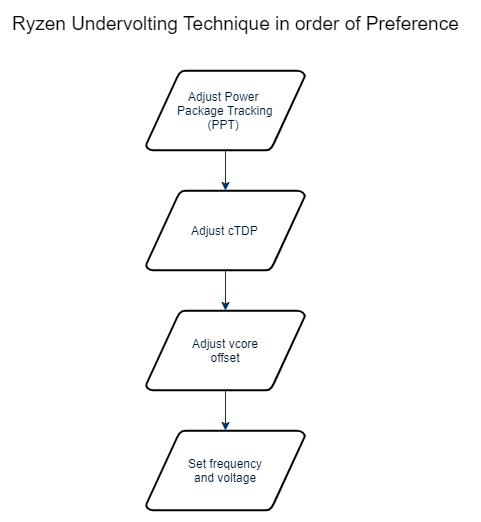

Compared to [how to undervolt your gpu](/how-to-undervolt-gpu/), undervolting your CPU can be daunting as the technique to achieve undervolting can change based on your CPU, motherboard vendor, motherboard model, and even motherboard version. This guide is sticking to undervolting AMD Ryzen chips to keep the scope in check. Even though there are lots of variables hopefully everyone can find a solution. 

In this guide, we'll **undervolt a Ryzen 2700 to a 2700E's TDP**. But this can also be used to undervolt a 3900X to 65W, if one can't get their hand on the [OEM-only part](https://www.anandtech.com/show/14961/amd-brings-ryzen-9-3900-and-ryzen-5-3500x-to-life).

Components we'll be using:

- [Cinebench R20](https://www.maxon.net/en-us/products/cinebench-r20-overview/): Free CPU benchmark for single thread and multi-threaded workloads. It will let us quantify any performance loss due to undervolting. We're using R20 rather than R15 as with recent Ryzen chips
- [HWiNFO64](https://www.hwinfo.com/): to measure our sensor readings (temperature, wattage, etc)
- Google sheets: A spreadsheet for tracking power usage, benchmarks, any modifications, etc
- (optional): [P4460 Kill a Watt](http://www.p3international.com/products/p4460.html) electricity usage monitor: to measure output from the wall. This is the only thing that costs money on the list -- you may be able to rent it from a local library or utility company. A wattmeter is not critical, but it'll give us a sense of total component draw that the PSU has to supply. I bought one from my local hardware store.

## Important HWiNFO sensors

I've highlighted all the sensors in HWiNFO that we'll be using during our benchmarking

After a benchmark has concluded, we'll record the two numbers in the max column and then click the highlighted reset button to have a clean slate for our next benchmark run.

The reason why we're interested in max values instead of something like averages, is due to undervolting wanting to achieve values below a threshold. For instance, we want to achieve temperatures below thermal throttling and power usage below the budget for the GPU.

## PSU and power draw example

Before we dive too deep into undervolting, let's break down what it really means when we're measuring the number of watts flowing through the wattmeter:

- Kill A Watt shows 200 watts
- The PSU ([SSP-300-SUG](https://seasonic.com/pub/media/pdf/industrial/datasheet/SSP-300-SUG.pdf)) is 300W 80 Plus Gold certified
- Since the PSU is gold certified, while between 20-100% load, it's able to to convert 87%-90% of inbound power to the components with the rest dispersed as heat
- Thus components are asking between 174-180 watts (else the PSU would be rated silver or platinum) 
- If the components are asking for max power (300 watts), the Kill A Watt should be reading 337-344 before shutdown

## Initial Benchmarks and Measurements

First we'll measure idle for completeness:

- Close all programs including those in the background using any cpu cycles
- Open HWiNFO
- Wait for the system to settle down (ie, the wattmeter converges to a reading)
- Record what's being pulled from the wall, and max sensor info from HWiNFO.

Then benchmark the gpu for timespy, the score you are interested in is the graphics score. Use the process listed below

- Keep everything closed, except HWiNFO
- Reset HWiNFO sensors
- Run Timespy
- Record score, max wattmeter reading, max watts / temp from the gpu
- Repeat three times

Here's an example of what I recorded for my initial measurements and how I interpreted them:

- Average Timespy score: 5976
- Max wattmeter reading: 241W
- Max GPU watts: 159W
- Max GPU temperature: 82c
- Our GPU exceeds it's TDP rating by 10W and total component draw is around 210-217W (241 * [.87, .9]).