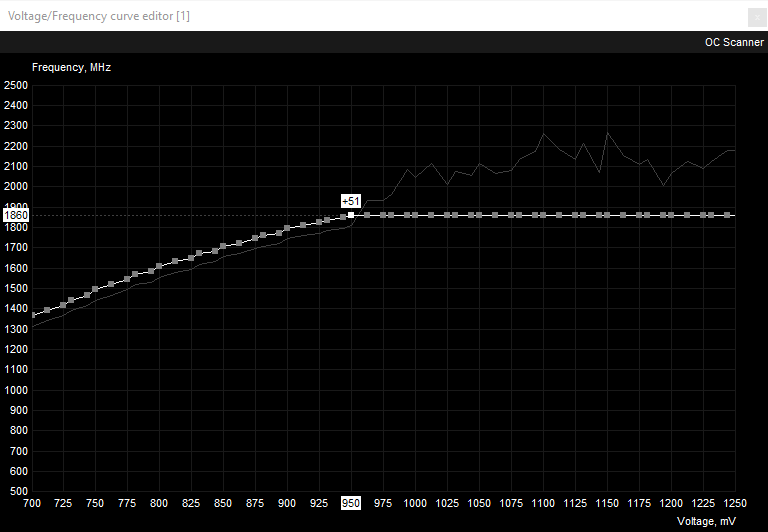

Small form factor enthusiasts repeatedly stuff power hungry components into tighter spaces. Sometimes things get too hot or too powerful. Or maybe a power supply is starting to fail, etc. Luckily, one can undervolt their most power hungry component, which is more likely than not the GPU, and can achieve power savings with temperature reduction all without sacrificing performance. And undervolting the GPU can be done quite quickly by any layperson.

Not to spoil anything but we'll **undervolt a GTX 1070 to within a GTX 1060's TDP with no performance drops**

Components we'll be using:

- [3dmark Timespy](https://store.steampowered.com/app/223850/3DMark/): Free GPU benchmark. To install, just make sure you click "Download Demo" in Steam. This benchmark will report a graphics score that we can use to detect performance regressions.
- [HWiNFO64](https://www.hwinfo.com/): to measure our sensor readings (temperature, wattage, etc)
- [MSI Afterburner](https://www.msi.com/page/afterburner): to tweak the voltage / frequency curve of the gpu
- Google sheets: A spreadsheet for tracking power usage, benchmarks, any modifications, etc
- (optional): [GPU-Z](https://www.techpowerup.com/gpuz/): we'll only be using this tool, which provides a host of GPU information, for determining a GPU's boost clock (but you can consult the manufacturer's website too)
- (optional): [P4460 Kill a Watt](http://www.p3international.com/products/p4460.html) electricity usage monitor: to measure output from the wall. This is the only thing that costs money on the list -- you may be able to rent it from a local library or utility company. A wattmeter is not critical, but it'll give us a sense of total component draw that the PSU has to supply. I bought one from my local hardware store.

Feel free to swap components out for alternatives, but I do want to stress the importance of benchmarks, as it's desirable for any potential performance loss to become apparent when running benchmarks at each stage of the undervolt.

Attentive readers will note the absence of any stress tests (eg: Prime95 With AVX & Small FFTs + MSI Kombustor). It is my opinion that drawing obscene amounts of power to run these stress tests is just too unrealistic. Benchmarks should be stressful enough, else what are they benchmarking? I've used this method of undervolting for several months and have not experienced any crashes in game or other intensive workloads. But I understand the drive for those who want ultimate stability, so for that audience, I'd suggest after we work our way down the voltage ladder to start climbing up if stress tests fail.

Due note that it is easiest to perform undervolting with a PSU that is in good working condition with enough power to supply components at stock and then transfer to a smaller PSU if desired. This is also not a requirement, but saves troubleshooting time for those sticking 300w of components in with a 200w PSU.

## Important HWiNFO sensors

I've highlighted all the sensors in HWiNFO that we'll be using during our benchmarking

After a benchmark has concluded, we'll record the two numbers in the max column and then click the highlighted reset button to have a clean slate for our next benchmark run.

The reason why we're interested in max values instead of something like averages, is due to undervolting wanting to achieve values below a threshold. For instance, we want to achieve temperatures below thermal throttling and power usage below the budget for the GPU.

## PSU and power draw example

Before we dive too deep into undervolting, let's break down what it really means when we're measuring the number of watts flowing through the wattmeter:

- Kill A Watt shows 200 watts
- The PSU ([SSP-300-SUG](https://seasonic.com/pub/media/pdf/industrial/datasheet/SSP-300-SUG.pdf)) is 300W 80 Plus Gold certified
- Since the PSU is gold, while between 20-100% load, it's able to to convert 87%-90% of inbound power to the components with the rest dispersed as heat
- Thus components are asking between 174-180 watts (else the PSU would be rated silver or platinum) 
- If the components are asking for max power (300 watts), the Kill A Watt should be reading 337-344 before shutdown

## Initial Benchmarks and Measurements

First we'll measure idle for completeness:

- Close all programs including those in the background using any cpu cycles
- Open HWiNFO
- Wait for the system to settle down (ie, the wattmeter converges to a reading)
- Record what's being pulled from the wall, and max sensor info from HWiNFO.

Then benchmark the gpu for timespy, the score you are interested in is the graphics score. Use the process listed below

- Keep everything closed, except HWiNFO
- Reset HWiNFO sensors
- Run Timespy
- Record score, max wattmeter reading, max watts / temp from the gpu
- Repeat three times

Here's an example of what I recorded for my initial measurements and how I interpreted them:

- Average Timespy score: 5976
- Max wattmeter reading: 241W
- Max GPU watts: 159W
- Max GPU temperature: 82c
- Our GPU exceeds it's TDP rating by 10W and total component draw is around 210-217W (241 * [.87, .9]).

## GPU Undervolt

### Determine Target Frequency

First, determine what target frequency you'd like your GPU to boost to, ideally a number between the GPU's boost clock and max clock. The GPU's boost clock will be listed in the manufacturer's specification and also in [GPU-Z](https://www.techpowerup.com/gpuz/). The GPU's max clock is determined at runtime through [GPU boost](https://www.anandtech.com/show/10325/the-nvidia-geforce-gtx-1080-and-1070-founders-edition-review/15) and will be reported as the "GPU Clock" in HWiNFO64 (make sure it's running while the benchmark are in progress). Below are screenshots from HWiNFO64 and GPU-Z showing the differences between these two numbers.

So from those two screenshots, we can see

- Boost clock: 1721mhz
- Max clock: 1886mhz

[GPU boost](https://www.anandtech.com/show/10325/the-nvidia-geforce-gtx-1080-and-1070-founders-edition-review/15) (different from boost clock) increases the GPU's core clock while thermal and TDP headroom remain. This is somewhat counterproductive for us as any voltage increases to reach higher frequencies will cause an increase in power usage and blow our budget.

I chose my target frequency to be 1860mhz -- 139mhz over boost and 26mhz under max, as during benchmarking the gpu clock was pinned at 1860mhz most the time (this is where HWiNFO average readings can come in handy!). The exact number doesn't matter, as one can adjust their target frequency depending on their undervolting results. I change my target frequency later on. We'll also choose our starting voltage to be 950mv, which is a pretty middling undervolt, and we'll work our way down.

### MSI Afterburner

The tool for undervolting! Powerful, but can be unintuitive at first.

Ctrl + F to bring up the voltage frequency curve. Find our target voltage of 950mv and take note of the frequency (1809mhz in the screenshot)

Our target frequency (1860mhz) is greater than 1809mhz by 51mhz, so we switch back to the starting window and increase the core clock by 51mhz.

This will shift the voltage frequency graph up by 51mhz ensuring a nice smooth ride up the voltage / frequency curve until we hit 1860mhz at 950mv. Then to guarantee we don't exceed 950mv:

- Select the point at 950mv
- Hit "l" to lock the voltage
- For all voltage points greater than 950mv, drag them to or below 1860mhz
- Hit "✔" to apply
- Afterburner will adjust the points to be the same frequency as our locked voltage
- You may have to comb over >950mv points to ensure that afterburner didn't re-adjust any voltage points to be greater than 1860mhz. It happens
- Hit "✔" to apply

End result should look like:

Since no voltage has a clock frequency greater than the frequency at 950mv, Afterburner will ensure that no voltage exceeding 950mv will be delivered to the GPU as there isn't any frequency left to gain.

After our hard work, we'll want to save this as a profile so that we can refer back to it after we inevitably undervolt too far. In addition, after determining what is the best undervolt, we'll want to have that profile loaded on boot, so ensure the windows icon is selected.

### Rinse and Repeat

Do the benchmark routine:

- Clear / reset sensor data for max power usage and temperature
- Start Timespy
- Keep eyes glued on the kill a watt and record max draw
- After Timespy completes record score, gpu max power usage, max temperature, and wall max wall draw.
- Repeat 3 times

After three successful benchmarks:

- Open Afterburner
- Reset the voltage / frequency graph by hitting the "↺" icon
- Decrement the target voltage by 25mv and keep the same target frequency
- Calculate new core clock offset from new target voltage
- Proceed to adjust all greater voltages to our frequency
- Re-benchmark

### Results

- Undervolted to 875mv at 1860mhz
- 850mv was not stable
- No affect on Timespy score (<1% difference)
- GPU max wattage decreased from 159W to 124W (20-23% reduction)
- GPU max temp decreased from 82 to 75 (9-10% reduction)
- Attempting an undervolt of 875mv at 1886mhz (the original max clock) was not stable

These are good results that demonstrate that there is no performance loss from undervolting, yet one can mitigate heat and power usage.

### One step further

I decided to double down on undervolting and see just how far we can take this. I repeated all the steps we've taken but with a target frequency set to the GPU's boost clock (1721MHz). Fast forward an hour later and this is the resulting voltage / frequency curve I ended with.

And for completeness sake, here are all my results across all undervolts.

- Undervolted to 800mv at 1721mhz
- Slight decrease to Timespy score (6-7%)
- GPU max wattage decreased from 159W to 105W (33% reduction)
- GPU max temp decreased from 82 to 68 (15-17% reduction)

To me, the loss in performance in this chase to undervolt is greatly outweighed by the gain in efficiency.

## Conclusion

As a comparison

- A GTX 1060 6GB has a TDP of 120W
- A GTX 1060 6GB has an average [Timespy score of 4227](https://www.3dmark.com/newsearch#advanced?test=spy%20P&cpuId=&gpuId=1096&gpuCount=1&deviceType=DESKTOP&memoryChannels=0&country=&scoreType=graphicsScore&showInvalidResults=false)
- A GTX 1070 has an average [Timespy score of 6082](https://www.3dmark.com/newsearch#advanced?test=spy%20P&cpuId=&gpuId=1090&gpuCount=1&deviceType=DESKTOP&memoryChannels=0&country=&scoreType=graphicsScore&showInvalidResults=false&max=7705)
- With our Timespy score of 5948 at 124W, we have GTX 1070 performance at GTX 1060's TDP
- With our Timespy score of 5600 at 105W, we're more energy efficient than a GTX 1060 yet still command a massive performance advantage

In the end, we've decreased power usage for the GPU considerably (54 watts!), lowered temperatures, and opted into additional undervolts for a near neglible performance loss.
