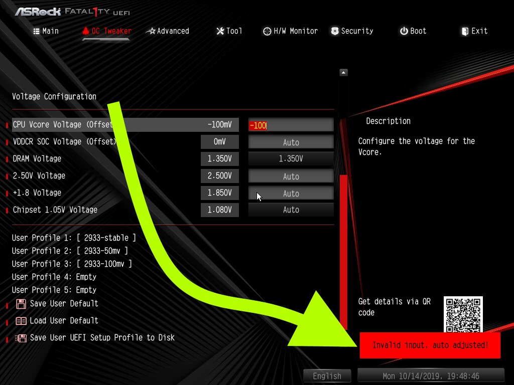

**Note: This is a living guide, corrections, suggestions and additional data points are welcomed**

Undervolting your CPU can make your system run cooler, quieter, and more efficiently. Compared to [how to undervolt your gpu](/how-to-undervolt-gpu/), undervolting your CPU can be daunting as the technique to achieve undervolting can change based on your CPU, motherboard vendor, motherboard model, and even motherboard BIOS version. This guide is focussing on undervolting desktop AMD Ryzen chips to keep the scope somewhat in check. Even though there are lots of variables hopefully everyone can find a solution. 

In this guide, we'll **undervolt a Ryzen 2700 to a 2700E's TDP**. But this can also be used to undervolt a 3900X (a 105W TDP processor) to 65W if one can't get their hand on the [OEM-only 65W 3900](https://www.anandtech.com/show/14961/amd-brings-ryzen-9-3900-and-ryzen-5-3500x-to-life).

Components we'll be using:

- [Cinebench R20](https://www.maxon.net/en-us/products/cinebench-r20-overview/): Free CPU benchmark for single thread and multi-threaded workloads. It will let us quantify any performance loss due to undervolting. We're using R20 rather than R15, so that high core count CPUs take long enough to complete to help get consistent readings.
- [HWiNFO64](https://www.hwinfo.com/): to measure our sensor readings (temperature, wattage, etc)
- Google sheets: A spreadsheet for tracking power usage, benchmarks, any modifications, etc
- (optional): [P4460 Kill a Watt](http://www.p3international.com/products/p4460.html) electricity usage monitor: to measure output from the wall. This is the only thing that costs money on the list -- you may be able to rent it from a local library or utility company. A wattmeter is not critical, but it'll give us a sense of total component draw that the PSU has to supply. I bought one from my local hardware store.

Feel free to swap components out for alternatives, but I'd like to stress two things:

- A benchmark that provides a multi-threaded and single threaded score. Undervolting may effect one more than the other and we need to capture that.
- The use of an external measurement tool (like the Kill a Watt). Undervolting can cause hardware sensor misreporting, which has tripped up even seasoned SFF enthusiast [Optimum Tech](https://www.youtube.com/watch?v=2wM3obN2pAE) (see [Gamers Nexus's response](https://www.gamersnexus.net/guides/3494-amd-ryzen-3000-undervolting-offset-override)). So if we arm ourselves with multiple tools, we can do a sanity check to make sure everything lines up.

## Important HWiNFO sensors

I've highlighted all the sensors in HWiNFO that we'll be using during our benchmarking

A few notes:

- I've higlighted the Ryzen 7 2700: **Enhanced** category (there's another category called "Ryzen 7 2700" that doesn't have temperature or power consumption that we'll ignore)
- After a benchmark has concluded, we'll record the two numbers in the max column and then click the highlighted reset button to have a clean slate for our next benchmark run.
- The reason why we're interested in max values instead of something like averages, is due to undervolting wanting to achieve values below a threshold. For instance, we want to achieve temperatures below thermal throttling and power usage below the budget for the CPU.

## PSU and power draw example

Before we dive too deep into undervolting, let's break down what it really means when we're measuring the number of watts flowing through the wattmeter:

- Kill A Watt shows 200 watts
- The PSU ([SSP-300-SUG](https://seasonic.com/pub/media/pdf/industrial/datasheet/SSP-300-SUG.pdf)) is 300W 80 Plus Gold certified
- Since the PSU is gold certified, while between 20-100% load, it's able to to convert 87%-90% of inbound power to the components with the rest dispersed as heat
- Thus components are asking between 174-180 watts (else the PSU would be rated silver or platinum) 
- If the components are asking for max power (300 watts), the Kill A Watt should be reading 337-344 before shutdown

## Initial Benchmarks and Measurements

First we'll measure idle for completeness:

- Close all programs including those in the background using any cpu cycles
- Open HWiNFO
- Wait for the system to settle down (ie, the wattmeter converges to a reading)
- Record what's being pulled from the wall, and max sensor readings from HWiNFO.

Then benchmark the cpu with Cinebench. We'll need to first configure Cinebench to show the single core benchmark like so:

After running, record both scores: the CPU and CPU (single core). Use the process listed below

")

- Keep everything closed, except HWiNFO
- Reset HWiNFO sensors
- Run Cinebench R20 "CPU" benchmark (multi-threaded)
- Record score, max wattmeter reading, max watts / temp from the cpu
- Run Cinebench R20 "CPU (Single Core)"
- Record score (the single core benchmark shouldn't exceed the wattage or temperature recorded from the multi-threaded test, so we can omit those)
- Repeat three times

Here's an example of what I recorded for my initial measurements:

- Average Cinebench score: multi-threaded: 3289, single-threaded: 398
- Max wattmeter reading: 129W
- Max CPU watts: 75W (note that the R2700 used in testing has an official TDP of 65W. ["It is a common mistake to conflate thermal watts (TDP) with electrical watts "power draw""](https://www.youtube.com/watch?v=tL1F-qliSUk&t=272s) - AMD. So it's more of a rule of thumb)
- Max CPU temperature: 75c

With our baseline set, it's time to start tweaking!

## CPU Undervolting

There are several knobs one can dial for Ryzen undervolting. Unfortunately, not all are available depending on the system. And if multiple techniques are available for one to use, they are not all considered equal. Some will wreck single threaded performance, so it is important to run single threaded benchmarks!

Without further ado, this is the basic flow chart you should be checking: select only the first box that's available to your system (if it's unavailable, doesn't work, or doesn't give the results you desire, go to the next box).

If a setting doesn't work, ensure you reset it to its default value so that it doesn't inhibit other settings.

### Power Package Tracking

First try altering the max amount of power delivered to the socket. [From Gamers Nexus](https://www.gamersnexus.net/guides/3491-explaining-precision-boost-overdrive-benchmarks-auto-oc)

> **Package Power Tracking ("PPT"):** The PPT threshold is the allowed socket
> power consumption permitted across the voltage rails supplying the socket.
> Applications with high thread counts, and/or heavy threads, can encounter PPT
> limits that can be alleviated with a raised PPT limit.
>
> 1. Default for Socket AM4 is at least 142W on motherboards rated for 105W TDP processors.
> 2. Default for Socket AM4 is at least 88W on motherboards rated for 65W TDP processors.

[Users have reported](https://www.reddit.com/r/Amd/comments/ceakbs/if_you_want_to_save_powerreduce_thermals_reduce/) that adjusting PPT affords significant efficiency gains compared to other methods. A user compared PPT adjustments to vcore offsets (which we'll get to later), and found power savings of nearly 40W.

To edit this setting, you'll need to enter the BIOS when booting the computer, which involves mashing some key combination (F1, F2, F3, DEL are common). The boot screen should momentarily display the key combination, so you don't have to guess.

For my bios, this option is not available (to give you an idea of its whereabouts, asrock states it'd be under "Advanced\AMD CBS\NBIO Common Options\XFR Enhancement\Accepted\Precision Boot Overdirve\Enable". If you have a screenshot with the PPT setting, I'd love to include it in this guide). In the event this option is available to you:

- Set the PPT at a slight offset (140W for a 105W CPU or 85W for a 65W CPU)
- Run both Cinebench benchmarks 3 times. Record scores, temperature, and power usage. 
- Increase the offset until desired threshold.

One can try PPT adjustment coupled with a [negative vcore offset](#vcore-offset) for further gains, but mileage may vary.

### Configurable TDP

The next knob to try is definitely hit or miss, even if a BIOS presents the option -- it's changing the TDP to the desired wattage. Have a 95W CPU but want a 65W one? Set the cTDP to 65 (or 65000 depending on the BIOS).

But make sure you have your sensors and benchmarks readied. A single run of Cinebench should let you know if your cTDP has been exceeded and thus ineffective.

One user had fantastic success [setting the cTDP on their 2700X](https://www.reddit.com/r/Amd/comments/9mxs88/ryzen_7_2700x_ctdp_test_15w_vs_35w_vs_65w_vs_auto/), but others weren't so lucky (may have been different motherboards or BIOS versions).

While my 2700 ignored cTDP (even with turbo boost disabled), I'm assuming if a chip is listed on AMD's site or WikiChip containg a "cTDP down", [like the 2400G](https://en.wikichip.org/wiki/amd/ryzen_5/2400g), then cTDP will work.

### Vcore offset

Don't get discouraged if nothing has worked thus far, through setting a vcore offset one may be able to achieve the truest form of undervolting: lower power consumption without a loss in performance. The best thing is that most motherboards should support this: asrock, [MSI](https://www.overclock.net/forum/13-amd-general/1718046-msi-finally-added-offset-mode.html), asus, biostar, and potentially some gigabytes.

Below is a screenshot of adjusting the offset value in millivolts.

While I normally recommend setting the value in increments of 10mv, the BIOS can be finicky sometimes. I was only able to get "-50mv" and "-100mv" to stick, any other values would cause it to be reset to "Auto" or display an error if -100 was exceeded.

Thus I ran the -50mv offset three times in cinebench, and then moved onto a -100mv offset, which proved stable as well.

#### Results

- No difference in either Cinbench score
- ~10W decrease in CPU power usage
- ~5 degree drop in CPU temperature

This may seem a little underwhelming, but I'm happy to accept this. Our CPU is more efficient and cooler than before and there isn't a performance penalty.

### Set frequency and voltage

Have you exhausted the other options? If so, time to get discouraged. There will be a sacrifice -- potentially a heavy sacrifice in single threaded performance. I promised we'd achieve a more dramatic drop in power usage when I mentioned we'd take a 2700 and turn it into a 2700E (vcore offset only netted a 10W efficiency gain), so we'll be entering in set frequency and voltages for the greatest control.

Most if not all motherboards should be capable of accepting an arbitrary frequency and voltage.

Your starting frequency and voltage will depend on your setup:

- Start the frequency at your processor's default base clock (3.2GHz for my R2700).
- Start the voltage at the default value as well (1V)
- Decrease voltage by 0.025 until unstable in Cinebench (Cinbench reports an error, crashes, or blue screen) and then decrease frequency by 100MHz

Due note that just changing these two settings may not be enough. Your system may detect the new voltage / frequency, but see that it has plenty of power left in it's budget and turbo beyond that disregarding your intentions. The solution is to disable precision boost. For asrock motherboards this is called Core Performance Boost (CPB)

Disabling CPB means that cores can't exceed our set frequency (in the screenshots, it's 3.0GHz). Considering the [turbo frequency of a 2700 is 4.1GHz](https://en.wikichip.org/wiki/amd/ryzen_7/2700) that's a 1.1GHz decrease! And since the [2700E has a turbo frequency of 4.0GHz](https://en.wikichip.org/wiki/amd/ryzen_7/2700e), we'll be even slower than 2700E in single thread performance. The only redeeming quality is that our base clocks are 200MHz higher.

Let's benchmark the 0.875mv @ 3.0GHz setup and see where it lands.

#### Results

- Multi-threaded score dropped ~250 points (8%) to around 3030
- Single threaded score dropped ~100 points (25%) to around 303
- CPU power draw dropped ~30W (so we've achieved 2700E levels of power usage)
- CPU temps dropped ~15 degrees

Overall, I'd say this type of undervolting / underclocking isn't normally worth it. A 25% decrease in single threaded performance is tough to swallow unless you built a computer for purely multi-threaded workloads. Don't get me wrong, even at a 25% decrease, the computer operates normally. And a [youtuber did demonstrate](https://www.youtube.com/watch?v=dU0--0gyxks) that games ran surprisingly well even at an absurd underclock of 800MHz. Just know that there is a tangible cost with this method. 

I wish I could say more about how the undervolted scores compare to other CPUs at stock especially the 2700E. The best I can do is take a [list of unofficial scores](https://www.cgdirector.com/cinebench-r20-scores-updated-results/) coupled with [smattering of official scores](https://www.anandtech.com/show/14053/maxon-releases-cinebench-r20-benchmark) and say that in the multi-threaded benchmark, we land around the 2600X mark while handily beating the i7-7700K (both 95W TDP). The single thread score is about equal to i7-4850HQ's, a 4C/8T mobile processor with a 47W TDP.

An interesting note, while running the underclock, HWiNFO seemed to report bizarre numbers. Even at idle, it was reporting core clocks to be at their max of 3GHz. Initially, I thought that this meant the system wasn't idling, but HWiNFO power usage reported values that contradicted this thought. Power usage was at idle, but clocks were at 3GHz.

This is where our wattmeter comes into play. I saw that wattmeter was also reporting idle power usage (this is why we measure at idle!), so I could rest easy knowing that the CPU wasn't burning through electricity needlessly. In general, the workload that the CPU is executing when at a given frequency will effect the power consumption. If the CPU isn't performing any actions at 3GHz, it won't consume significant power. This is known as the [activity factor](http://www.siliconintelligence.com/people/binu/perception/node13.html). Even without knowing about activity factory we can use multiple tools to determine the state of our computer.

## Conclusion

All this info can be overwhelming, but to distill this down with the example used throughout this guide (ryzen 2700 and asrock B450 itx motherboard):

- PPT option was not available in BIOS
- cTDP had no effect
- A max vcore offset of -100mv saw a 10W drop in CPU power draw and a modest 5 degrees temperature reduction without performance regressions
- Undervolting to 0.875mv and underclocking to 3Ghz saw a more dramatic decrease in power usage (down to 48W) but came with a 25% performance drop in single threaded workloads, which is hard to tolerate.

I decided on vcore offset being the most appropriate undervolt for me.

Your conclusion **will** differ. Happy undervolting.

## FAQ

### What about Ryzen Master?

Any guide on Ryzen undervolting would be remiss if it didn't at least mention AMD's [Ryzen Master](https://www.amd.com/en/technologies/ryzen-master). It's a useful tool for a couple of reasons:

- Tweak values at runtime without a restart (though some may still require a restart)
- Create multiple profiles: one for gaming, one for rendering footage
- A second data point for determining what one can edit in the BIOS. For instance, if you are unable to edit PPT in the BIOS and unable to edit it in Ryzen Master (shown below) -- you'll have to skip PPT undervolting.

But there are some caveats with Ryzen Master: Windows only and CPU virtualization must be disabled in the BIOS. I'm a developer that works on virtual machines, so it'll throw some error about Ryzen Master only able to run with Virtualization Based Security disabled.

So for those on Windows who don't have virtual machines and don't mind installing Ryzen Master, it can be a helpful tool.

### What about stress tests?

Potentially the most controversial aspect of this guide is the nonchalant nod I'll be giving stress tests. I can't omit them, as else this guide may feel inadequate, but I won't emphasize their necessity. People will disagree about which stress tests should be ran, how they should be ran, the durations of the tests, and anyone not following their formula is sacrificing stability. Instead, I believe one should craft their own stress scenario filled with realistic workloads they perform on a day to day basis. For me, that's compiling, video encoding, and gaming.

So after you've settled on your undervolt you can tease out instability issues by running your stress test, and you should already feel pretty confident about stability as Cinebench R20 should have completed multiple times at a given undervolt. If stability is desired even during unrealistic workloads, then stress test programs like [Prime95](https://www.mersenne.org/download/#stresstest) can be used.

The number of torture test threads to run will auto-detect the right number.

Run Prime95's torture test for the desired length of time (some people will measure in minutes while others measure in days).

To please the torture stress test disciples in preparation of this article, I ran my -100mv vcore offset in prime95 for several hours, even though I had already been running the undervolt for several months without stability issues. No issues arose. If they had, and it's bothersome (it isn't to me), the undervolt can be adjusted. The main takeaway here is that you want to be comfortable with your computer -- however you define that.

## Discussion

This article has been discussed at the following external sites

- [Reddit](https://www.reddit.com/r/sffpc/comments/djmel7/how_to_undervolt_your_ryzen_cpu/)
