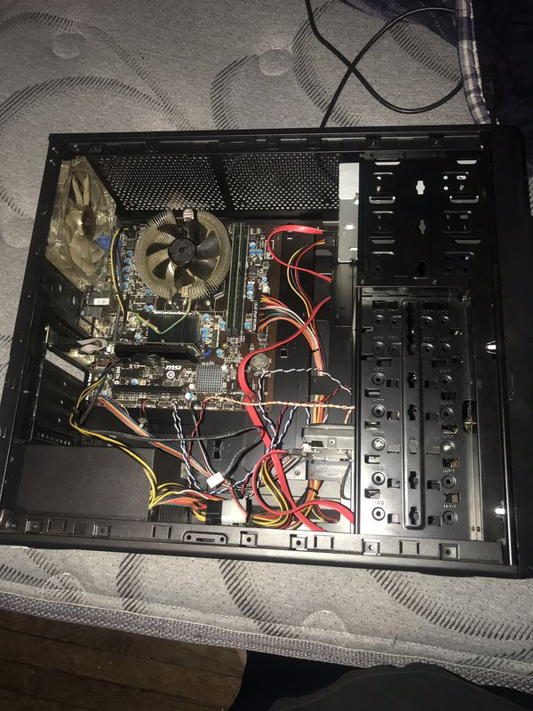
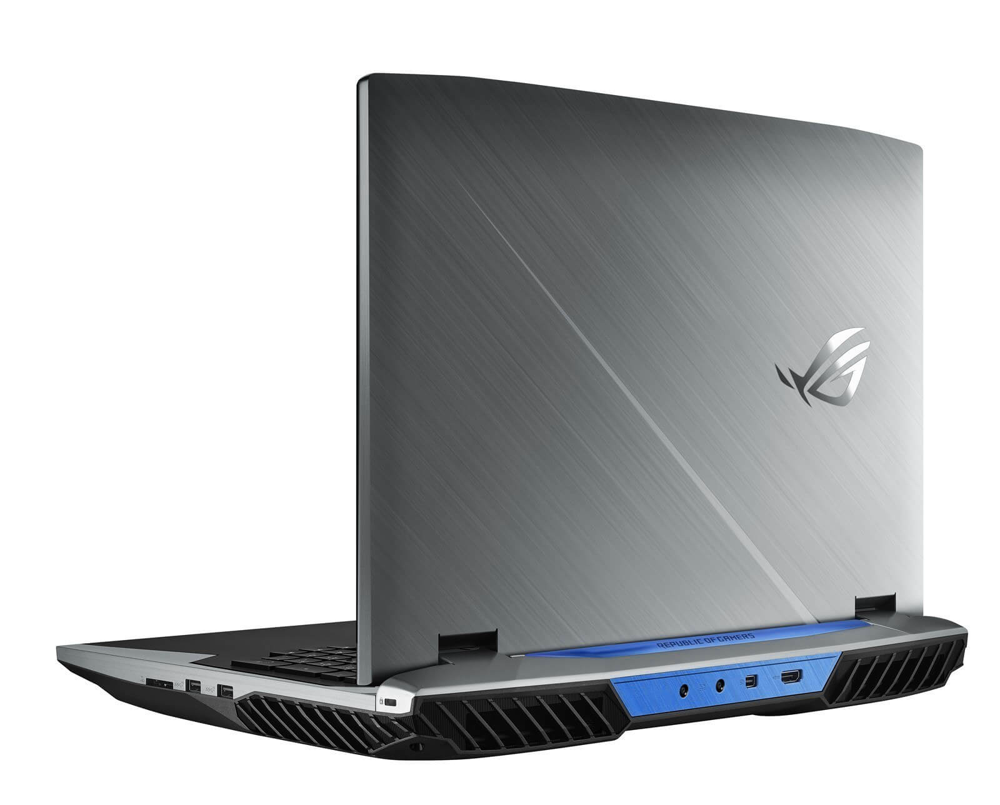

As most small form factor enthusiasts, I can trace my orgins from traditional ATX desktops as it was the only thing I was exposed to. Growing up, all computers we bought, whether pre-built or assembled, were ATX mid towers. Then when I built my first computer, I gladly accepted the offer of full sized case from a friend. Since I wasn't aware of small form factor, I didn't even consider it.

After several years of trying to fill out all the space, I ended up with:

Not bad, but not great -- definitely not small form factor. Clean looks, but I desperately bought high end fans to fill space, which only resulted in a squandered budget. People often opt for larger builds claiming expansion potential, easy to work on, and powerful but I disagree:

- After three years I hadn't bought anything to make use of another PCIe expansion slot (either SLI, capture card, or 10GB NIC)
- I found working on the PC to be a chore. I had to wiggle it from out under a desk (in a tiny apartment there was no room for it ontop of a desk), and then I had to clear a workspace for it.
- SFF PCs can be just as powerful as their full sized relatives: for example, I would consider a build with a 9900k and a 2080TI to be in the upper echelons of powerful builds and [Optimum Tech fit those in a Ghost S1](https://www.youtube.com/watch?v=H8RmWvrKhdY). One can fit 9700k and a 2080 in a 5L [S4M](https://nfc-systems.com/skyreach-4-mini)
- SFF PCs can be packed full of storage. Fit 1-2 2TB M.2 drives and 1-2 4TB 2.5" drives. Consider a dedicated NAS if this is still not enough storage

I couldn't stand it, so I started looking smaller and in that I time, I stumbled across SFF communities, who sometimes (maybe too harshly) [deride especially egegrious builds](https://smallformfactor.net/forum/threads/the-space-inefficiency-thread.471/) (below is a build found for sale):

The best thing about this community is they tend to be creator centric. Lots of people try their hand at designing cases, creative builds, and reviewing components. I fell in love, bought multiple cases and power supplies and have no regrets.

But why not a gaming laptop or an ultrabook + eGPU?

### Gaming Laptops

While gaming laptops can be powerful, compared to small form factor, they are louder, barely more portable, and significantly more expensive.

Check out [NotebookCheck's Top 10 Gaming Laptops](https://www.notebookcheck.net/Notebookcheck-s-Top-10-Gaming-Notebooks.98628.0.html), at the time of writing every single one of those laptops is > $2000. You could build a more powerful, SFF friendly pc for $1000-1100, and for anyone in doubt:

- \$600 for 2070S mini
- \$170 for R1600 + B450 itx
- \$60 for case (Node 202, SG13)
- \$50-75 for 16GB RAM
- \$100 for 512GB-1TB NVMe
- \$80 for psu

You now have \$1000 leftover to buy any peripherals you desire.

Now onto portability, here's how laptopmag.com describes laptop sizes (emphasis mine):

> - 15 inches: The most popular size, 15-inch laptops are the least expensive and provide plenty of desktop real estate. While most 15-inchers are easy to take from room to room, some are on the bulky side.
> - 17 to 18 inches: **If your laptop stays on your desk all day**, a 17- or 18-inch system will likely provide everything you need for work and play. Many gaming notebooks are in this size category.

Huh, to me sounds like "bulky" and "stays on your desk all day" are significant drawbacks for device that aims to be portable. These aren't laptops you're taking on the go. With battery life measured in minutes, one is tied to an outlet and some models even require two power bricks. The only thing going for these laptops is an integrated screen, and with the advent of portable monitors this is becoming less of a selling point. Since both bulky gaming laptops and SFF PCs can fit in backpacks, I can only give a slight edge to the laptops.

There is no contest when it comes to noise. Anyone who has used a laptop for a non-trivial task (rendering, compiling, gaming) will admit to a loud, high pitched whine. This can be immensely distracting when working. While headphones are often the prescribed remedy, sometimes I like a nice silent workspace without worrying about fans. Not to mention upgrading the cooling solution on a laptop ranges from difficult to impossible, but for desktop components, one can swap upgrade with relative ease.

Instead of buying one gaming laptop and sacrifice every aspect, buy a thin and light and small form factor PC for the same price, desk real estate, and net wins in portability and performance.

### eGPUs

The best solution on paper should be eGPUs: have a single thin and light computing device for travel and when home dock to an eGPU for gaming or GPU intensive workloads. However, under the surface they have serious flaws:

- Need laptop with thunderbolt 3 x4 port (not ubiquitous)
- Not enough bandwidth on thunderbolt port for full performance realization (1080 eGPU saw a 25% performance hit compared to desktop version)
- Need expensive enclosure (look to spend \$300 or more)
- [eGPUs are "finicky" and "have a long way to go before it becomes truly plug and play"](https://www.notebookcheck.net/Aorus-RTX-2070-Gaming-Box-with-Dell-XPS-13-9380-Review.413819.0.html)
- eGPUs are large. The [smallest eGPU is 3.3L](https://www.gigabyte.com/us/Graphics-Card/GV-N2070IXEB-8GC#kf) in size, while [the Velka 3](https://www.velkase.com/products/velka-3) is a full blown case that fits the same GPU in 3.7L. The [number one recommended eGPU](https://egpu.io/best-egpu-buyers-guide/), the Razer Core X, is 14.5L in size -- absolutely absurd. The gold standard for compatibility in the SFF world is the [NCASE M1](https://www.sfflab.com/products/ncase_m1) and that is smaller at 12.6L.

eGPUs: slow, expensive, and large.

### Conclusion

[Linus said it best](https://www.youtube.com/watch?v=ivyYAv7wd8g)

> You can make a pretty strong argument for the [best setup] being having a gaming desktop at home and a thin and light when travelling.

[and again](https://youtu.be/SHOMc4XU8jM)

> In a perfect world, I'd have a thin and light laptop for travel and a desktop for gaming.

And I'd agree, except that the desktop should be small form factor for ease of maintenance and space savings without sacrificing noise or power.
